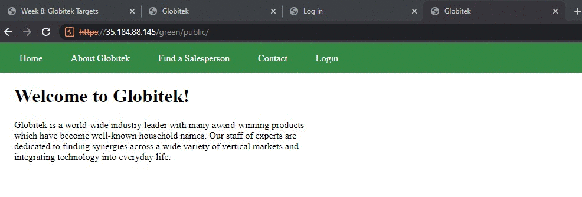
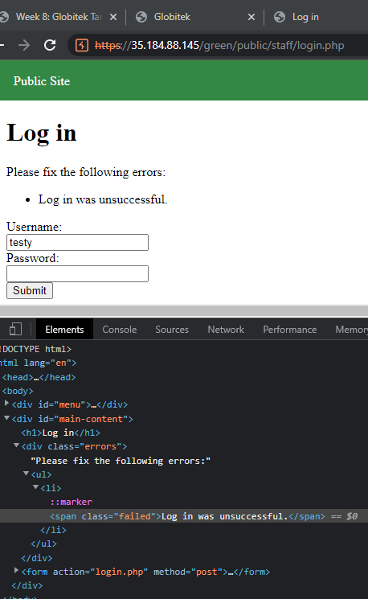
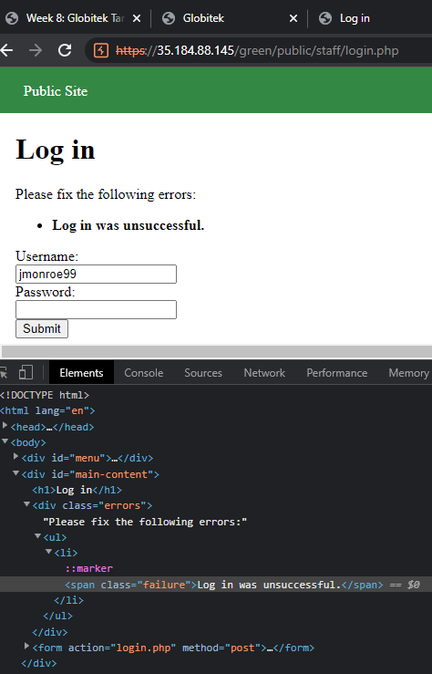
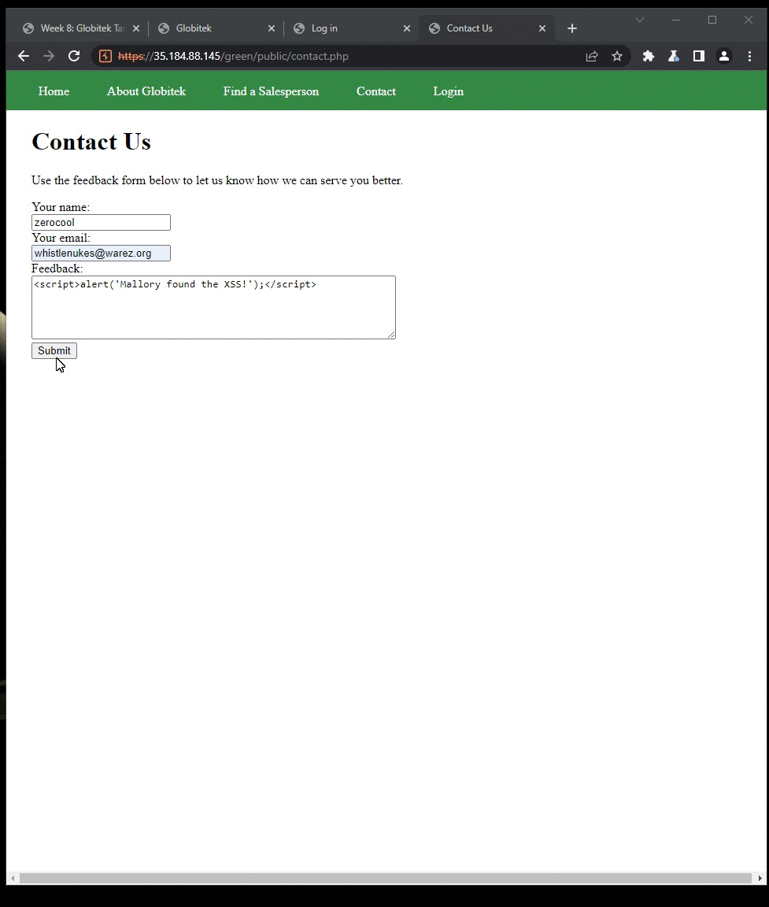
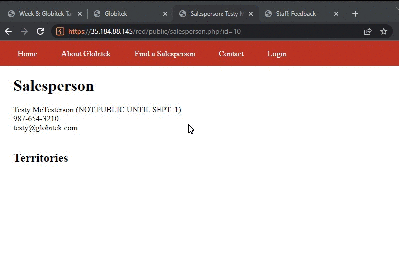

# Pen Testing Live Targets

Time spent: **X** hours spent in total

> Objective: Identify vulnerabilities in three different versions of the Globitek website: blue, green, and red.

The six possible exploits are:

* Username Enumeration
* Insecure Direct Object Reference (IDOR)
* SQL Injection (SQLi)
* Cross-Site Scripting (XSS)
* Cross-Site Request Forgery (CSRF)
* Session Hijacking/Fixation

Each color is vulnerable to only 2 of the 6 possible exploits. First discover which color has the specific vulnerability, then write a short description of how to exploit it, and finally demonstrate it using screenshots compiled into a GIF.

## Green

### Vulnerability #1: User Enumeration

Description:
The developer left a clue that the username being entered is correct/incorrect. There is a different error class if the password is entered incorrectly for an existing account. Failed vs. Failure class, picture below. 

### Vulnerability #2: Cross Site Scripting

## Red

Vulnerability #1: IDOR

Description:

## Notes

The cross site scripting for green was a little tricky trying to find the right place to inject the xss and then honestly I had a brain-blank and forgot I had to login to view the results. 

